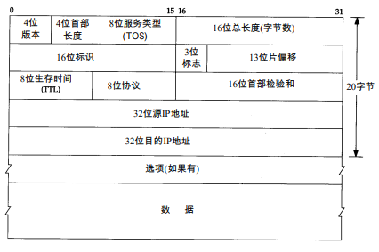

* 所有的TCP、UDP、ICMP、ICMP数据都以IP数据报格式传输。
* 特点：
  * 不可靠：他不能保证IP数据报能成功到达目的地，如果发生某种错误，IP有一个简单的错误处理算法：丢弃该数据，然后发送ICMP消息报给信源端。
  * 无连接：IP并不维护任何关于后续数据报的状态信息，每个数据报的处理是相互独立的。IP可以不按顺序接收，如果信源向信宿发送两个连续的数据报，则每个数据报都是独立地进行路由选择。

### IP头部

<!-- 

-->

* TCP/IP首部中的所有二进制整数再网络中传输都要求大端（最高位在左边，最低为在右边），这种字节序又叫网络字节序。

#### 各个字段的含义

* 协议版本号是4。
* 首部长度...。首部最长为60个字节。
* 服务类型包括一个3bit的优先权子字段（现在已经被忽略），4bit的TOS字段和1bit未用但必须为0的字段。4bit的TOS分别代表：最小时延、最大吞吐量、最高可靠性和最小费用。4bit只能置其中1bit。
* 总长度字段是指整个IP数据报的长度，以字节为单位，利用首部长度字段和总长度字段，就可以知道IP数据报中数据内容的起始位置和长度。
* 标识字段唯一地标识主机发送的每一份数据报。通常每发送一份报文它的值就会加1。
* TTL（time-to-live）生存时间字段设置了数据报可以经过最多的路由器数。它指定了数据报的生存时间。初始值由源主机设置（通常为32或64），一旦经过一个处理它的路由器，它的值就减去1。当该字段的值为1时，数据报就被丢弃，并发送ICMP报文通知源主机。
* 协议字段通过填充不同的标识符来表示哪一个高层协议将用于接收IP分组中的数据。

* 首部检验和字段是根据ip首部计算的检验和码。
* 每一份IP数据报都包含源ip和目的ip。
* 任选项是数据报中一个可变长的可选信息。
